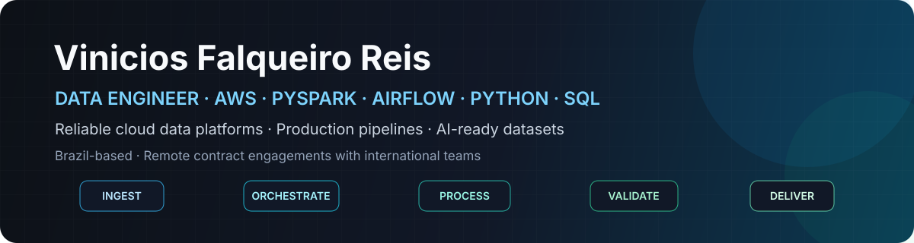

  

  
  
  

  
  
  

---

## About

I am a **Data Engineer** with nearly six years of experience across data analytics, process automation, and data delivery, including nearly two years building production workloads on AWS.

I design end-to-end data solutions—from ingestion and orchestration to distributed processing, validation, observability, and curated datasets for analytics and AI workloads. My background combines cloud engineering with operational and business experience, helping me translate real requirements into reliable, maintainable data products.

<table>
  <tr>
    <td width="25%" align="center"><strong>Cloud Data Platforms</strong> AWS lakehouse architecture and scalable storage</td>
    <td width="25%" align="center"><strong>Distributed Processing</strong> Spark and PySpark batch workloads</td>
    <td width="25%" align="center"><strong>Pipeline Reliability</strong> Airflow orchestration, validation, and observability</td>
    <td width="25%" align="center"><strong>AI-Ready Data</strong> Curated datasets and LLM-assisted enrichment</td>
  </tr>
</table>

### Selected professional impact

<table>
  <tr>
    <td width="25%" align="center"><strong>10+ TB/month</strong> Spark and PySpark workloads</td>
    <td width="25%" align="center"><strong>20% faster</strong> Pipeline runtime after optimization</td>
    <td width="25%" align="center"><strong>95% automated</strong> Recurring production workflows</td>
    <td width="25%" align="center"><strong>50% less</strong> Manual ingestion effort</td>
  </tr>
</table>

---

## Selected Work

<table>
  <tr>
    <td width="50%" valign="top">
      <h3><a href="https://github.com/vfreis/aws_data_lakehouse_pipeline">AWS Data Lakehouse Pipeline</a></h3>
      
A production-inspired AWS data platform that ingests, validates, transforms, and curates data through Bronze and Silver layers.

      
<strong>Demonstrates:</strong> modular ingestion, PySpark transformations, Airflow orchestration, incremental processing, data-quality checks, logging, and Parquet output.

      

        
        
        
        
      

      
<a href="https://github.com/vfreis/aws_data_lakehouse_pipeline"><strong>Architecture and source code →</strong></a>

    </td>
    <td width="50%" valign="top">
      <h3><a href="https://github.com/vfreis/superstore_sales">Superstore Sales Analytics & Segmentation</a></h3>
      
A combined Python and SQL analytics project exploring sales performance, customer behavior, and customer segmentation.

      
<strong>Demonstrates:</strong> data cleaning, exploratory analysis, advanced SQL queries, CTEs, window functions, feature scaling, and K-Means clustering.

      

        
        
        
        
      

      
<a href="https://github.com/vfreis/superstore_sales"><strong>Analysis and source code →</strong></a>

    </td>
  </tr>
  <tr>
    <td width="50%" valign="top">
      <h3><a href="https://github.com/vfreis/rfm_analysis-">RFM Customer Segmentation</a></h3>
      
A customer-segmentation analysis built from retail transaction data using Recency, Frequency, and Monetary features.

      
<strong>Demonstrates:</strong> transactional-data cleaning, RFM feature engineering, logarithmic transformation, standardization, K-Means clustering, and segment visualization.

      

        
        
        
        
      

      
<a href="https://github.com/vfreis/rfm_analysis-"><strong>Segmentation code →</strong></a>

    </td>
    <td width="50%" valign="top">
      <h3><a href="https://github.com/vfreis/data_migration">Data Migration & File Profiling</a></h3>
      
A Python toolkit for profiling heterogeneous CSV and spreadsheet sources before transformation or migration.

      
<strong>Demonstrates:</strong> file discovery, encoding detection, delimiter inference, schema and data-type profiling, structured logging, and migration-oriented inspection.

      

        
        
        
        
      

      
<a href="https://github.com/vfreis/data_migration"><strong>Migration utilities →</strong></a>

    </td>
  </tr>
</table>

> The AWS Data Lakehouse Pipeline is the flagship architecture project. The other repositories demonstrate complementary strengths in SQL analytics, customer segmentation, ingestion profiling, and data preparation.

---

## Core Stack

### Data Engineering and Processing

  
  
  
  
  
  
  
  

### Cloud, APIs, and Delivery

  
  
  
  
  
  
  
  
  

### Architecture, Quality, and Observability

  
  
  
  
  
  
  
  
  
  

---

## Remote Contract Engagements

I am available for **project-based and long-term remote contract engagements with international teams**, especially for work involving AWS data platforms, ETL/ELT modernization, Spark and PySpark processing, Apache Airflow orchestration, data-quality controls, and datasets that support analytics or AI applications.

For technical discussions or contract opportunities, reach out through [LinkedIn](https://www.linkedin.com/in/vfalqueiroreis/) or [email](mailto:vinicios.falqueiro@gmail.com).

---

  <strong>Reliable data platforms · Scalable pipelines · AI-ready datasets</strong>

